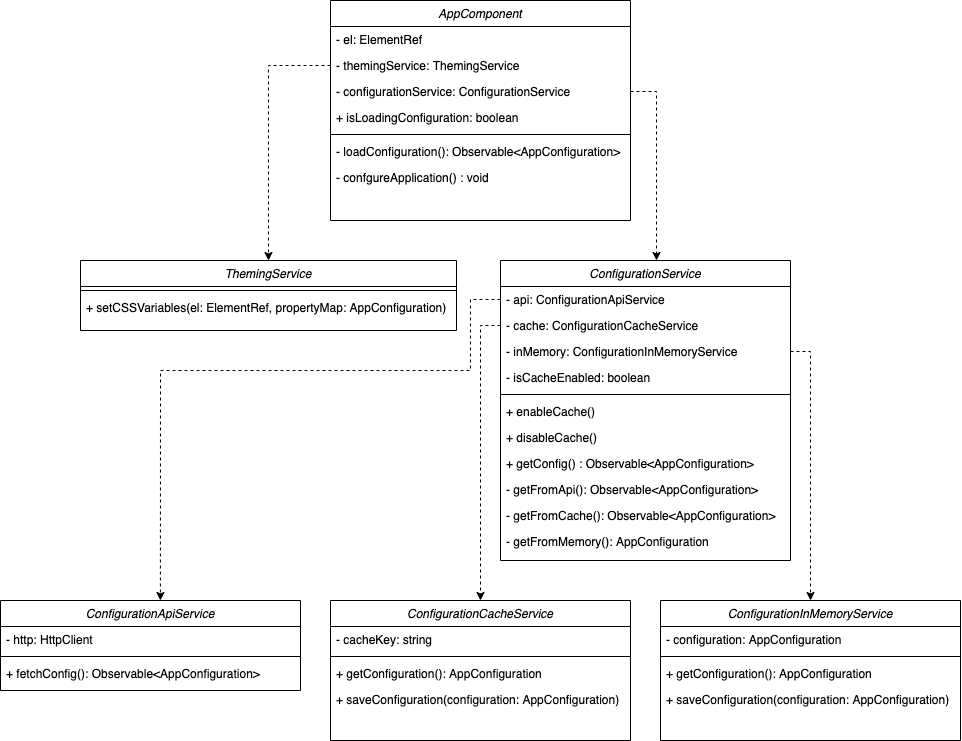

# Angular Whitelabel

Este projeto é um starter para uma aplicação Angular whitelabel. O escopo da parametrização é caraterísticas visuais, e a habilitação e desabilitação de funcionalidades.

## Arquitetura

### Diagrama de classes

### AppComponent

O componente base da aplicação Angular. O componente solicita a configuração do serviço de configuração e delega a customização visual ao serviço de tema.

### ThemingService

Serviço de tema responsável por aplicar configurações visuais ao DOM.

### ConfigurationService

Serviço de configuração que é efetivamente um repositório dos dados de configuração, no sentido do *repository pattern*. *ConfigurationService* tem como dependência *ConfigurationInMemoryService*, *ConfigurationCacheService*, *ConfigurationApiService* que servem como fontes de dados.

O serviço de configuração consulta os dados na seguinte ordem de preferência:
1. Dados em memória
2. Dados em cache, se o cache estiver habilitado
3. API

O uso do cache pode ser habilitado/desabilitado pelo serviço de configuração.

Os dados sempre são guardados em memória após consulta independente da fonte.

### ConfigurationApiService
Serviço responsável por fazer uma requisição **http** para buscar a configuração.

### ConfigurationCacheService
Serviço responsável por usar o **local storage** para buscar e guardar a configuração.

### ConfigurationInMemoryService
Serviço responsável por buscar e guardar a configuração **em memória**.